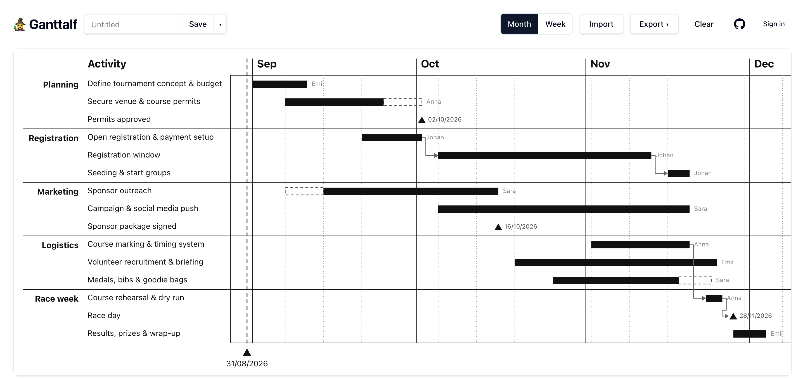

<div align="center">

# 🧙 Ganttalf

**Beautiful Gantt charts, straight from Excel.**

Drop a spreadsheet · drag bars & milestones · export to PowerPoint, PNG, SVG · share with a link

[](https://svelte.dev)
[](https://vitejs.dev)
[](https://tailwindcss.com)
[](https://supabase.com)



</div>

Thinkcell-style Gantt chart maker. Drop an Excel file, drag bars and milestones,
export back to Excel, PNG, SVG, or PowerPoint (editable native shapes).

Pure static SPA (Svelte 5 + Vite + Tailwind 4) backed by [Supabase](https://supabase.com)
for Google/GitHub sign-in and per-user chart storage. No server of its own.

## ✨ Features

| | |
|---|---|
| 🕵️ **Anonymous editing** | Drop an `.xlsx`, edit, export; work persists in localStorage. No account needed. |
| 🔐 **Sign in to save** | Google or GitHub sign-in; charts are stored per user (Postgres row-level security — nobody else can see or list them). |
| 🔗 **Live share links** | `/s/<token>` shows the latest saved version of a chart, read-only, to anyone with the link. Revocable via *Export → Stop sharing*. Viewers can export or make their own editable copy. |
| 📸 **Snapshot links** | The whole chart compressed into the URL fragment (`/#g=…`); frozen at share time, works without any account or database. |
| 📤 **Real PowerPoint export** | Every bar, label, and milestone lands as an editable native shape in the `.pptx`. |

## 📄 Excel format

First sheet, case-insensitive headers: **Activity** (required), Group,
Tentative Start, Start, End, Tentative End, Milestone, Responsible, Depends On.
Dates as Excel dates, `yyyy-mm-dd`, or `dd/mm/yyyy`. Download the template from
the app's drop zone.

## 🛠️ Development

```sh
npm install
npm run template        # generates public/template.xlsx
cp .env.example .env.local   # fill in your Supabase project URL + anon key
npm run dev             # http://localhost:5173
```

## 🗄️ Supabase setup (one-time)

1. Create a project at [supabase.com](https://supabase.com).
2. Run `supabase/migrations/0001_init.sql` in the SQL editor.
3. Google Cloud Console → create an OAuth 2.0 Client ID (Web application) with
   authorized redirect URI `https://<project-ref>.supabase.co/auth/v1/callback`.
4. Supabase dashboard → Authentication → Providers → Google → paste the client
   ID and secret.
5. Authentication → URL Configuration: set the Site URL to your production
   domain and add `http://localhost:5173/**` (plus `https://<prod-domain>/**`)
   to Additional Redirect URLs.
6. Copy the project URL and anon key (Settings → API) into `.env.local`.

The anon key is public by design — row-level security is the boundary. The only
anonymous read path is the `get_shared_chart(token)` RPC, an exact-match lookup
on a random 128-bit token.

## 🚀 Deploy (Vercel)

Framework preset **Vite**, build `npm run build`, output `dist`. Set
`VITE_SUPABASE_URL` and `VITE_SUPABASE_ANON_KEY` in the project's environment
variables. `vercel.json` rewrites all paths to `index.html` so `/c/<id>` and
`/s/<token>` deep links work.

## ⚠️ Note on `src/lib/share.js`

The `#g=` codec is shared with an external tool (`make-gantt.mjs` Claude skill).
Do not refactor it — the encoder and decoder must stay byte-compatible.

## 📄 License

[MIT](LICENSE)
