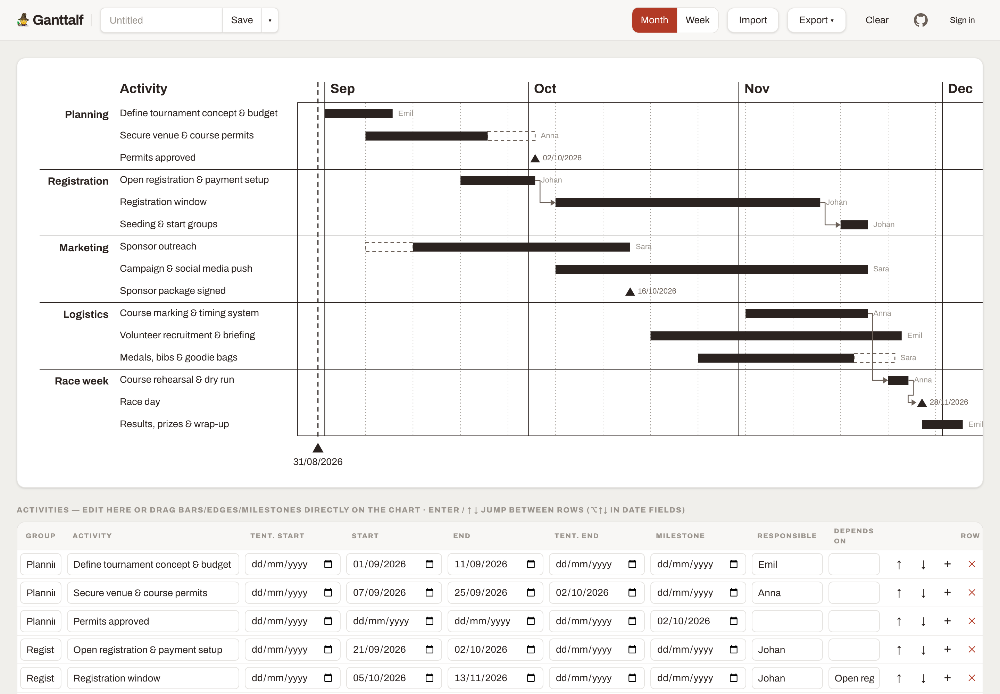

<div align="center">

# 🧙 Ganttalf

**Beautiful Gantt charts, straight from Excel.**

Drop a spreadsheet · drag bars & milestones · export to PowerPoint, PNG, SVG · share with a link

[](https://svelte.dev)
[](https://vitejs.dev)
[](https://tailwindcss.com)
[](https://supabase.com)



</div>

Thinkcell-style Gantt chart maker. Drop an Excel file, drag bars and milestones,
export back to Excel, PNG, SVG, or PowerPoint (editable native shapes).

Pure static SPA (Svelte 5 + Vite + Tailwind 4) backed by [Supabase](https://supabase.com)
for Google/GitHub sign-in and per-user chart storage. No server of its own.

## ✨ Features

| | |
|---|---|
| 🕵️ **Anonymous editing** | Drop an `.xlsx`, edit, export; work persists in localStorage. No account needed. |
| 🔐 **Sign in to save** | Google or GitHub sign-in; charts are stored per user (Postgres row-level security — nobody else can see or list them). |
| 🔗 **Live share links** | `/s/<token>` shows the latest saved version of a chart, read-only, to anyone with the link. Revocable via *Export → Stop sharing*. Viewers can export or make their own editable copy. |
| 📸 **Snapshot links** | The whole chart compressed into the URL fragment (`/#g=…`); frozen at share time, works without any account or database. |
| 📤 **Real PowerPoint export** | Every bar, label, and milestone lands as an editable native shape in the `.pptx`. |

## 📄 Excel format

First sheet, case-insensitive headers: **Activity** (required), Group,
Tentative Start, Start, End, Tentative End, Milestone, Responsible, Depends On.
Dates as Excel dates, `yyyy-mm-dd`, or `dd/mm/yyyy`. Download the template from
the app's drop zone.

## 🛠️ Development

```sh
npm install
npm run template        # generates public/template.xlsx
cp .env.example .env.local   # fill in your Supabase project URL + anon key
npm run dev             # http://localhost:5173
```

## 🗄️ Supabase setup (one-time)

1. Create a project at [supabase.com](https://supabase.com).
2. Run `supabase/migrations/0001_init.sql` in the SQL editor.
3. Google Cloud Console → create an OAuth 2.0 Client ID (Web application) with
   authorized redirect URI `https://<project-ref>.supabase.co/auth/v1/callback`.
4. Supabase dashboard → Authentication → Providers → Google → paste the client
   ID and secret.
5. Authentication → URL Configuration: set the Site URL to your production
   domain and add `http://localhost:5173/**` (plus `https://<prod-domain>/**`)
   to Additional Redirect URLs.
6. Copy the project URL and anon key (Settings → API) into `.env.local`.

The anon key is public by design — row-level security is the boundary. The only
anonymous read path is the `get_shared_chart(token)` RPC, an exact-match lookup
on a random 128-bit token.

## 🚀 Deploy (Vercel)

Framework preset **Vite**, build `npm run build`, output `dist`. Set
`VITE_SUPABASE_URL` and `VITE_SUPABASE_ANON_KEY` in the project's environment
variables. `vercel.json` rewrites all paths to `index.html` so `/c/<id>` and
`/s/<token>` deep links work.

## 🤖 Claude skill

`.claude/skills/ganttalf/` is a [Claude Code](https://claude.com/claude-code) skill that
turns a described project plan into a chart: it writes a re-importable `.xlsx` and prints
a snapshot link that opens the chart pre-loaded. It reads charts back too, so you can hand
Claude an existing link or spreadsheet and ask for changes. Ask for "a gantt chart for ..."
while working in this repo and it picks the skill up automatically.

```sh
cd .claude/skills/ganttalf && npm install

node make-gantt.mjs rows.json plan.xlsx        # write .xlsx + snapshot link
node make-gantt.mjs --read <link|xlsx> rows.json   # read one back to JSON

export GANTTALF_URL=http://localhost:5173      # defaults to https://ganttalf.app
```

`--read` decodes `#g=` snapshot links and `.xlsx` files offline, and fetches `/s/<token>`
share links through `get_shared_chart`, the same anonymous lookup the app uses. Saved
charts (`/c/<id>`) sit behind the owner's sign-in, so share or export those first.

Reading a share link needs the project URL and anon key. Both are public by design, so
rather than committing them the script lifts them from the deployed bundle and caches
them for a day. `GANTTALF_SUPABASE_URL` and `GANTTALF_SUPABASE_ANON_KEY` override that
when self-hosting.

### Install it on any machine

The skill talks to the hosted app, so nothing needs to run locally. In Claude Code:

```
/plugin marketplace add esenilsson/ganttalf
/plugin install ganttalf@ganttalf
```

That is the whole setup — the skill and its dependency are fetched for you, and
`/plugin update ganttalf` picks up later changes. Then just ask for a Gantt chart.

Prefer not to use plugins? Drop the folder into your personal skills directory:

```sh
mkdir -p ~/.claude/skills/ganttalf
curl -fsSL https://github.com/esenilsson/ganttalf/archive/refs/heads/main.tar.gz \
  | tar -xz --strip-components=4 -C ~/.claude/skills/ganttalf ganttalf-main/.claude/skills/ganttalf
npm install --prefix ~/.claude/skills/ganttalf   # optional, only for .xlsx output
```

Without the `npm install` step the skill still produces share links; only the
spreadsheet is skipped, and it tells you so.

### Install it in the Claude app

The Claude desktop and web apps take skills as a zip. Build one:

```sh
./scripts/make-skill-zip.sh          # writes ganttalf-skill.zip
```

Then in Claude, go to **Customize → Skills → Add → Upload a skill** and pick the zip.
Code execution must be enabled under Settings → Capabilities, since the skill runs a
bundled Node script. The zip holds the skill folder as its root entry and leaves
`node_modules` out, which is what the uploader expects.

Tagged builds publish that archive too, so you can hand someone a download link instead
of a checkout:

```sh
git tag skill-v1 && git push origin skill-v1
```

### Keeping the two codecs in sync

`npm run check:skill` asserts what the warning below only asks for: that the skill's
field order matches `src/lib/share.js`, that a chart survives both round trips (share
link and `.xlsx`), and that `SKILL.md` stays inside the Claude app's frontmatter limits.
CI runs it on every pull request.

## ⚠️ Note on `src/lib/share.js`

The `#g=` codec is shared with the skill's `make-gantt.mjs` encoder.
Do not refactor it — the encoder and decoder must stay byte-compatible.

## 📄 License

[MIT](LICENSE)
